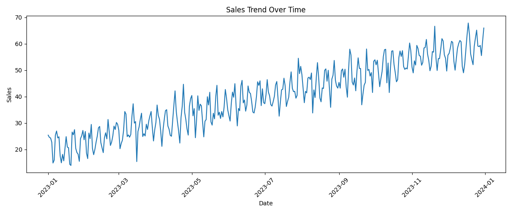
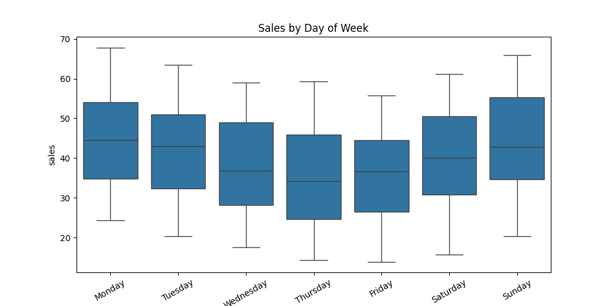
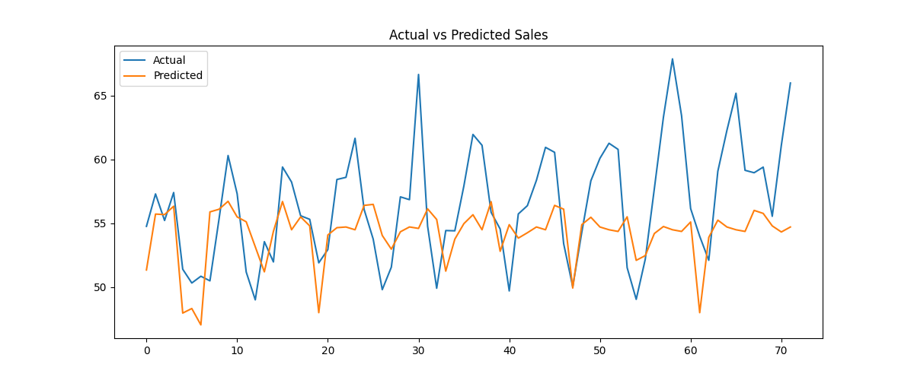
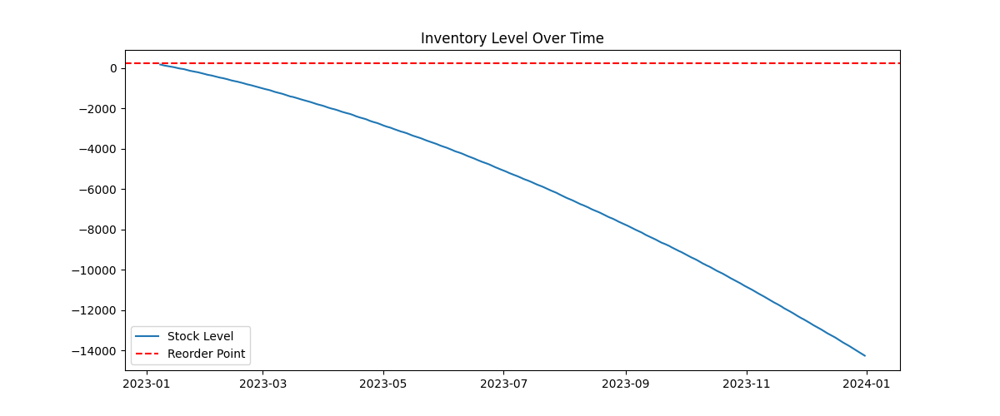

# 🛒 Retail Sales Forecasting & Inventory Optimization System


---

## 📌 Project Overview

An **end-to-end retail analytics system** designed to:

* 📈 Forecast future product demand using Machine Learning
* 📦 Optimize inventory using safety stock & reorder logic
* 📊 Generate actionable business insights

This project simulates how real-world retail companies make **data-driven inventory decisions**.

---

## 🎯 Problem Statement

Retail businesses face two major challenges:

* ❌ Stockouts → Lost sales & poor customer experience
* ❌ Overstock → Increased storage cost & wastage

This system addresses both by combining **demand forecasting + inventory optimization**.

---

## 💼 Business Impact

* 🔹 Reduces stockout risk
* 🔹 Minimizes excess inventory
* 🔹 Improves demand planning
* 🔹 Enables smarter supply chain decisions

---

## 🧠 Tech Stack

* **Programming:** Python
* **Data Processing:** Pandas, NumPy
* **Visualization:** Matplotlib, Seaborn
* **Machine Learning:** Scikit-learn (Linear Regression)
* **Environment:** Jupyter Notebook

---

## 🏗️ System Architecture

```
Raw Data 
   ↓
Data Cleaning & Validation
   ↓
Exploratory Data Analysis (EDA)
   ↓
Feature Engineering (Lag Features)
   ↓
Sales Forecasting Model
   ↓
Inventory Optimization (Safety Stock + ROP)
   ↓
Business Insights & Reports
```

---

## 📊 Key Visual Insights

### 📈 Sales Trend (Business Growth)



---

### 📅 Weekly Demand Pattern



---

### 🤖 Forecast vs Actual (Model Performance)



---

### 📦 Inventory Optimization (Reorder Logic)



---

## ⚙️ How to Run

```bash
git clone https://github.com/your-username/retail-sales-forecasting-inventory-optimization.git
cd retail-sales-forecasting-inventory-optimization

python -m venv venv
venv\Scripts\activate      # Windows
source venv/bin/activate   # Mac/Linux

pip install -r requirements.txt
python main.py
```

---

## 📂 Project Structure

```
Retail-Forecasting-System/
├── data/
├── notebooks/
├── src/
├── outputs/
├── images/
├── reports/
├── main.py
├── requirements.txt
└── README.md
```

---

## 🔍 Key Insights

* Sales exhibit a **clear upward trend**, indicating business growth
* Demand shows **weekly seasonality patterns**
* Forecasting model achieves **low prediction error**
* Inventory levels frequently approach reorder point → need optimization

---

## 🚀 Future Enhancements

* Multi-product & multi-store forecasting
* Advanced models (XGBoost, ARIMA, Prophet)
* Real-time dashboard (Streamlit)
* Automated replenishment system

---

## 👨‍💻 Author

Md Anus

---

⭐ If you found this project useful, consider giving it a star!

